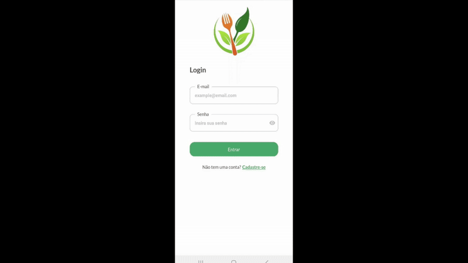
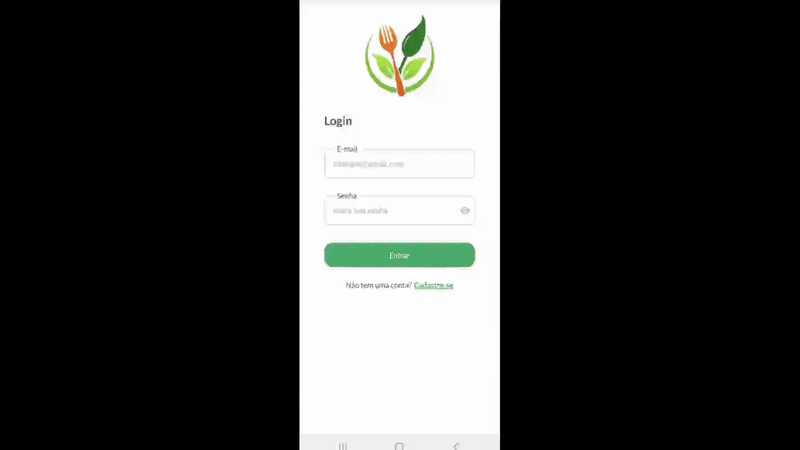

# 📱🥗 Análise Nutricional de Pratos com IA


# Sumário
* [Sobre o Projeto](#sobre-o-projeto)
* [Contribuidores](#contribuidores)
* [Tecnologias](#tecnologias)
* [Protótipo Figma](#protótipo-figma)
* [App na Prática](#app-na-prática)
  * [Login](#login)
  * [Cadastro](#cadastro)
  * [Enviar Imagem e Ver Resultado](#enviar-imagem-e-ver-resultado)
* [Pré-requisitos](#pré-requisitos)
* [Análise do Prato de comida](#análise-do-prato-de-comida)
* [Endpoints da API](#-endpoints-da-api)
* [Inicializando o Projeto](#inicializando-o-projeto)
  * [Backend](#backend)
  * [Frontend](#frontend)
> ⚠️ **[Aviso Importante](#aviso-importante)**

<br>

## Sobre o Projeto
Este projeto tem como objetivo desenvolver um aplicativo inovador que utiliza inteligência artificial para analisar imagens de refeições e fornecer informações nutricionais detalhadas com base nos alimentos identificados. A partir do envio de uma foto de um prato, o sistema é capaz de reconhecer os itens alimentares presentes e estimar sua composição nutricional, permitindo ao usuário ter uma noção mais clara da qualidade de sua alimentação.

A aplicação oferece uma análise automatizada que indica se o prato é saudável ou não, calcula a quantidade de macronutrientes (proteínas, carboidratos e gorduras) e estima o valor calórico total da refeição. Além disso, apresenta a distribuição nutricional por alimento, facilitando a compreensão do impacto de cada item no todo. O projeto busca unir acessibilidade, praticidade e tecnologia de ponta para promover uma maior conscientização nutricional e auxiliar os usuários a fazerem escolhas alimentares mais equilibradas em seu dia a dia.

<br>

## Contribuidores
<table>
  <tr>
    <td align="center">
      <a href="https://github.com/gustavojoze">
        
        <br />
        <sub><b>Gustavo José</b></sub>
      </a>
    </td>
    <td align="center">
      <a href="https://github.com/JulianaHaddad">
        
        <br />
        <sub><b>Juliana Haddad</b></sub>
      </a>
    </td>
    <td align="center">
      <a href="https://github.com/LucasOkokama">
        
        <br />
        <sub><b>Lucas Okokama</b></sub>
      </a>
    </td>
    <td align="center">
      <a href="https://github.com/pedro-Trovo">
        
        <br />
        <sub><b>Pedro Trovo</b></sub>
      </a>
    </td>
    <td align="center">
      <a href="https://github.com/RenanPJ/">
        
        <br />
        <sub><b>Renan Pereira</b></sub>
      </a>
    </td>
    <td align="center">
      <a href="https://github.com/vicabats">
        
        <br />
        <sub><b>Vitória Batistoti</b></sub>
      </a>
    </td>
  </tr>
</table>

<br>

## Tecnologias
A aplicação foi desenvolvida com React Native (Expo) no frontend, proporcionando uma experiência mobile intuitiva e responsiva. No backend, utiliza Express.js para a criação dos endpoints responsáveis pela comunicação com a API Gemini e pelo processamento das informações nutricionais. 

Além disso, o backend também integra um banco de dados MySQL para armazenar de forma estruturada os dados dos usuários, como nome, e-mail e informações de login. Para garantir a segurança das credenciais, o projeto utiliza a biblioteca bcrypt, que realiza a hash das senhas antes de armazená-las no banco, protegendo os dados contra acessos não autorizados.

<table align="center">
  <tr>
    <th></th>
    <th>Frontend</th>
    <th>Backend</th>
  </tr>
  <tr>
    <th>Linguagens</th>
    <td>
      <a href="https://developer.mozilla.org/en-US/docs/Web/JavaScript">
        
      </a>
    </td>
    <td>
      <a href="https://developer.mozilla.org/en-US/docs/Web/JavaScript">
        
      </a>
      <a href="https://www.mysql.com/">
        
      </a>
    </td>
  </tr>
  <tr>
    <th>Frameworks / Bibliotecas</th>
    <td>
      <a href="https://reactnative.dev/">
        
      </a>
      <a href="https://expo.dev/">
        
      </a>
    </td>
    <td>
      <a href="https://nodejs.org/">
        
      </a>
      <a href="https://expressjs.com/">
        
      </a>
      <a href="https://www.mysql.com/">
        
      </a>
      <a href="https://www.npmjs.com/package/bcrypt">
        
      </a>
    </td>
  </tr>
  <tr>
    <th>Editor</th>
    <td>
      <a href="https://code.visualstudio.com/">
        
      </a>
    </td>
    <td>
      <a href="https://code.visualstudio.com/">
        
      </a>
    </td>
  </tr>
</table>

<br>

## Protótipo Figma
Clique no botão abaixo para acessar o projeto diretamente no Figma:

[](https://www.figma.com/proto/kbsADu9RapNf2PGsgVe4z5/NutriApp?node-id=1-9&p=f&t=DzcY7YnjhHRYmXEi-1&scaling=contain&content-scaling=fixed&page-id=0%3A1)

<br>

## App na Prática

### Login


### Cadastro


### Enviar Imagem e Ver Resultado


<br>

## Pré-requisitos
1. Instalar [`Node.js`](https://nodejs.org/)
2. Instalar [`Expo CLI`](https://docs.expo.dev/get-started/installation/) para o frontend mobile
3. Instalar [`MySQL`](https://dev.mysql.com/downloads/mysql/) (não esqueça de ativar a service MySQL80)
4. Criar uma [`API Key`](https://ai.google.dev/gemini-api/docs/api-key) do Gemini

<br>

## Análise do Prato de comida

### 🔗 Endpoint: 
```bash
POST /gemini/analyze
```
### 🧠 O que faz?
Esse endpoint utiliza inteligência artificial (Google Gemini) para analisar a foto de um prato de comida, cruzando as informações visuais com um arquivo CSV da [`TACO`](https://www.cfn.org.br/wp-content/uploads/2017/03/taco_4_edicao_ampliada_e_revisada.pdf) (Tabela Brasileira de Composição de Alimentos), que contém os dados nutricionais dos alimentos. Através de prompts bem definidos, o modelo gera uma análise nutricional estimada do prato, retornando os alimentos identificados, seus respectivos valores calóricos, os macronutrientes e uma avaliação se o prato é considerado saudável ou não.

### 📥 Request
| Campo        | Tipo   | Descrição           |
| ------------ | ------ | ------------------- |
| `imagePath`  | `file` | Foto do prato (JPG) |
| `tablePath`  | `file` | Arquivo CSV da TACO |

### 📤 Response
| Campo             | Tipo    | Descrição                                                                                          |
| ----------------- | ------- | -------------------------------------------------------------------------------------------------- |
| `alimentos`       | Array   | Lista de alimentos identificados no prato, contendo nome e calorias de cada alimento.              |
| `macronutrientes` | Array   | Lista dos macronutrientes totais do prato, contendo nome do macronutriente e quantidade em gramas. |
| `ehSaudavel`      | Boolean | Indica se o prato é considerado saudável (`true` ou `false`), baseado na composição nutricional.   |

```json
{
  "alimentos": [
    {
      "alimento": "Arroz",
      "calorias": 250
    },
    {
      "alimento": "Feijão",
      "calorias": 150
    }
  ],
  "macronutrientes": [
    {
      "macronutriente": "Proteínas",
      "gramas": 20
    },
    {
      "macronutriente": "Carboidratos",
      "gramas": 50
    },
    {
      "macronutriente": "Gorduras",
      "gramas": 15
    }
  ],
  "ehSaudavel": true
}
```

<br>

## 📡 Endpoints da API

### 🔸 Criar aluno
```bash
POST /aluno
```

### 🔸 Login do aluno
```bash
POST /aluno/login
```
### 🔸 Buscar todos os alunos
```bash
GET /aluno
```
### 🔸 Buscar aluno por ID
```bash
GET /aluno/:id
```
### 🔸 Atualizar aluno por ID
```bash
PUT /aluno/:id
```
### 🔸 Deletar aluno por ID
```bash
DELETE /aluno/:id
```
<br>

## Inicializando o Projeto

Clone o repositório e entre na pasta backend:
```bash
git clone https://github.com/pedro-Trovo/valores_nutricionais_do_prato.git
```
Entre na pasta do projeto:
```bash
cd valores_nutricionais_do_prato
```

<br>

### Backend
1. Entre na pasta `back-express` (crie um terminal especificamente para rodar o Backend):
```bash
cd back-express
```

2. Instale as `dependências`:
```bash
npm install
```

3. Crie e configure o arquivo `.env` com as variáveis de ambiente:
```bash
> Exemplo
DB_HOST=localhost
DB_USER=<SEU_USUARIO>
DB_PASSWORD=<SUA_SENHA>
DB_NAME=db_vnp
PORT=3000
GEMINI_API_KEY=<SUA_CHAVE_API>
```

4. Iniciando o banco de dados:
Para criar o banco de dados e as tabelas, execute o comando:
```bash
mysql -u root -p < database/init.sql
```

Após esse comando, será solicitado que você digite a senha do usuário root do MySQL.

Se o comando mysql não for reconhecido, significa que o Windows não está encontrando o executável do MySQL no PATH do sistema. 

Isso gera o seguinte erro:
```bash
'mysql' não é reconhecido como um comando interno ou externo
```

Para corrigir, siga os passos:
- Localize a pasta bin do MySQL e copie seu caminho (exemplo: `C:\Program Files\MySQL\MySQL Server 8.0\bin`)

- No Windows, abra o menu Iniciar e pesquise por `Editar variáveis de ambiente do sistema`.

- Na janela que abrir, clique em `Variáveis de Ambiente` e localize e selecione a variável chamada `Path`.

- Clique em `Editar`, depois em `Novo` e cole o caminho da pasta bin do MySQL.

- Salve todas as alterações e feche as janelas. Agora abra um novo Prompt de Comando (CMD) para que as mudanças tenham efeito.

- Execute novamente o comando para iniciar o banco:
```bash
mysql -u root -p < database/init.sql
```

Após esse comando, será solicitado que você digite a senha do usuário root do MySQL.


6. Inicie o servidor em modo desenvolvimento:
```bash
npm run dev
```
7. A API estará disponível em:
```bash
http://localhost:3000
```

<br>

### Frontend
1. Entre na pasta `mobile` (crie um terminal especificamente para rodar o Frontend):
```bash
cd mobile
```

2. Instale as `dependências`:
```bash
npm install
```

3. Crie e configure o arquivo `.env` com as variáveis de ambiente.
 
   Para encontrar seu endereço IPV4 basta abrir o `CMD` e digitar `ipconfig`.

   Siga o exemplo:
```bash
API_URL_IPV4=<SEU_ENDERECO_IPV4>
```

4. Inicie o app com `Expo`:
```bash
npm start
```

5. Abertura do app

#### 🖥️ Navegador com visualização mobile
1. Pressione `w` no terminal.
2. No navegador, abra as ferramentas de desenvolvedor (`F12` ou `Ctrl+Shift+I`).
3. Ative o modo responsivo (ícone de celular/tablet no DevTools).
4. Selecione um dispositivo (ex: iPhone 12) para simular a visualização mobile.

#### 📱 Dispositivo físico
1. Instale o app **Expo Go** no seu celular (Android ou iOS).
2. Escaneie o QR code que aparece no terminal.
3. O app será aberto no seu celular via rede local.
 
- Caso o `touch` não esteja funcionando, digite `m` no terminal que está executando o Expo. Isso ativará o `dev menu`.

#### 📱 Emulador Android/iOS
1. Certifique-se de que você tem um emulador Android ou iOS configurado.
2. Pressione `a` (Android) ou `i` (iOS) no terminal.
3. O app será aberto no emulador.

<br>

> [!WARNING] 
> # Aviso Importante

Este aplicativo tem caráter acadêmico, seu principal objetivo é demonstrar a viabilidade técnica da integração entre visão computacional e dados nutricionais públicos. Portanto, os resultados não devem ser utilizados para fins médicos ou profissionais.

Este aplicativo utiliza modelos de inteligência artificial (IA) para realizar estimativas nutricionais a partir de imagens. Embora os algoritmos sejam projetados para fornecer informações precisas com base nos dados disponíveis, os resultados gerados são apenas estimativas e não substituem a avaliação de um profissional de saúde ou nutricionista.

Fatores como qualidade da imagem, iluminação, posicionamento dos alimentos e variações na preparação podem influenciar diretamente na acurácia da análise.

Utilize os dados fornecidos como estimativa e não como diagnóstico definitivo.


